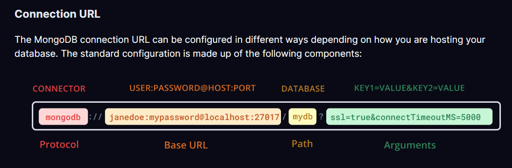

## Document to Install Prisma & MongoDB in your Project
https://www.prisma.io/docs/getting-started/setup-prisma/start-from-scratch/mongodb-typescript-mongodb
https://www.prisma.io/docs/orm/overview/databases/mongodb

Dummy Project Link:
https://www.prisma.io/docs/getting-started/setup-prisma/start-from-scratch/mongodb/next-steps

```bash
npm install prisma --save-dev

npx prisma init

npx prisma db push

npx install @prisma/client

```
Whenever you update your Prisma schema, you will need to run the prisma db push command to create new indexes and regenerate Prisma Client.

npx install @prisma/client:
For Querying the DataBase

Next steps:
1. Set the DATABASE_URL in the .env file to point to your existing database. If your database has no tables yet, read https://pris.ly/d/getting-started
2. Set the provider of the datasource block in schema.prisma to match your database: postgresql, mysql, sqlite, sqlserver, mongodb or cockroachdb.
3. Run prisma db pull to turn your database schema into a Prisma schema.
4. Run prisma generate to generate the Prisma Client. You can then start querying your database.


## MongoDB URL String:
